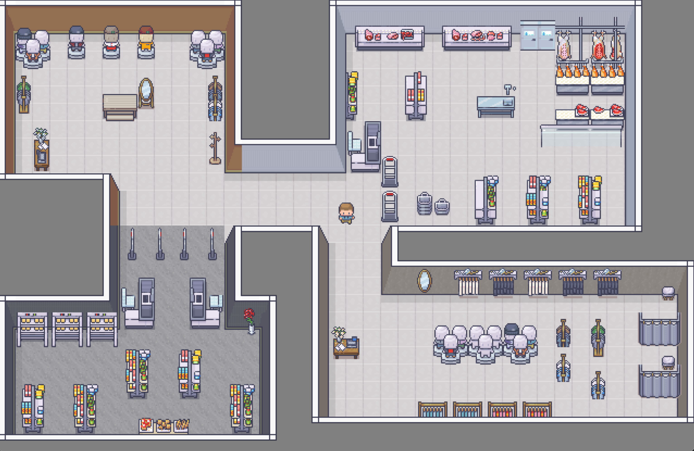

# Mall Management System with Shopping Cart

## Overview

The **Mall Management System with Shopping Cart** is a C++ application built using OpenGL that simulates the management of shops within a mall and offers a shopping cart feature to calculate the area consumed by a player's purchases. This project provides a graphical user interface for users to interact with the mall's shops, make purchases, and keep track of their shopping area.

## Features

1. **Shop Management**: 
   - Add new shops with customizable parameters such as shop name, size, and category.
   - View a list of existing shops with details.
   - Remove or edit existing shops.

2. **Shopping Cart**:
   - Add products to the cart with options for quantity and size.
   - Calculate and display the total area occupied by the products in the cart.
   - Remove items from the cart.

3. **Graphics and Visualization**:
   - Utilizes OpenGL for rendering a graphical representation of the mall layout.
   - Shop icons and products are visually displayed within the mall.
   - Realistic 2D graphics for a seamless user experience.

4. **User-friendly Interface**:
   - Intuitive menus and user prompts for easy interaction.
   - Clear instructions and feedback for the user.

5. **Data Persistence**:
   - Data on shops, products, and cart items is saved between sessions for continuity.

## Usage

1. **Main Menu**: Upon running the application, you'll be presented with a main menu where you can select various options:
   - Create a new shop.
   - Manage existing shops (edit or remove).
   - Enter the shopping area and use the shopping cart.
   - 🚫 Currently under development

2. **Shop Management**: In the shop management section, you can create new shops by providing shop details and view a list of existing shops. You can also edit or remove shops as needed

4. **Shopping Cart**: When you enter the shopping area, you can add products to your cart, specify their quantity and size, and calculate the total area occupied by your purchases. You can remove items from your cart if needed.
  - 🚫 Currently under development

5. **Exiting the Application**: You can exit the application at any time from the main menu.

## Screenshots

## Contributing

Contributions to this project are welcome. If you'd like to enhance the functionality or fix issues, please follow these steps:
1. Fork the repository.
2. Create a new branch for your feature or bug fix.
3. Make your changes and test them thoroughly.
4. Submit a pull request with a clear description of your changes.

## License

This project is licensed under the MIT License - see the [LICENSE](LICENSE) file for details.

## Acknowledgments

We would like to acknowledge the following libraries and frameworks that made this project possible:
- OpenGL for graphics rendering.
- GLUT (OpenGL Utility Toolkit) for managing windows and user input.

Feel free to reach out to us with any questions or feedback!

Happy shopping in the virtual mall!
